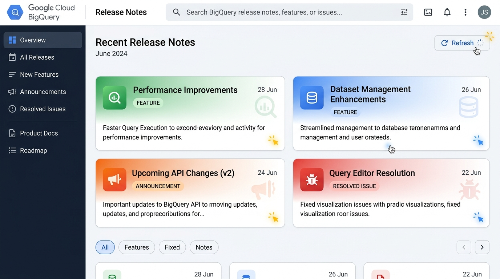

# 📢 BigQuery Release Notes & Social Broadcaster

A high-fidelity, interactive web application built with **Python Flask** and **Vanilla HTML/CSS/JS** that synchronizes Google Cloud's official BigQuery release notes and offers one-click social broadcasting.



---

## ✨ Features

- **🔄 Real-time Feed Synchronization:** Fetch, parse, and synchronize the official BigQuery release notes XML feed in real-time.
- **🔍 Text Search & Type Filtering:** Fast, client-side description search combined with category filtering badges (`Feature`, `Announcement`, `Issue`, `Deprecated`).
- **🎨 Dynamic Content Theming:** Automatically classifies each update description to set custom background gradients and attach subtle watermark icons:
  * ☁️ **Weather Theme:** Triggered by meteorology/weather terms.
  * ⚽ **Sports Theme:** Triggered by sporting terms.
  * 🧠 **AI/ML Theme:** Triggered by machine learning or generative AI terms.
  * 🔒 **Security Theme:** Triggered by security, IAM, or credentials terms.
  * 🗄️ **Storage Theme:** Triggered by database, partition, and table terms.
  * ⚡ **Performance Theme:** Triggered by latency, capacity, or speed terms.
  * 💻 **SQL Theme:** Triggered by syntax or query statements.
- **💥 Interactive Click Effects:** An energetic, realistic fire/spark particle burst that follows mouse clicks anywhere on the document.
- **🐦 Direct Tweet Intent:** Select an update card to launch a prefilled, length-capped Twitter/X intent window containing the update type, truncated description, and back-reference URL.

---

## 🛠️ Tech Stack

* **Backend:** Python 3.13+, Flask, `requests`, `feedparser`
* **Frontend:** Semantic HTML5, Vanilla CSS3 (custom CSS variables & keyframes), Vanilla JavaScript (DOM actions & event handlers)

---

## 📁 Project Structure

```text
bq-releases-notes/
├── .gitignore             # Git ignore file for environment and caches
├── app.py                 # Flask server and XML parser backend
├── requirements.txt       # Python library dependencies
├── README.md              # Project documentation
├── static/
│   ├── app.js             # Client-side render, search, and click effects
│   ├── style.css          # Layout styling, themes, and animations
│   └── readme_banner.jpg  # App preview banner
└── templates/
    └── index.html         # Main dashboard template
```

---

## 🚀 Setup & Execution

### 1. Clone & Navigate to Project Directory
```bash
cd bq-releases-notes
```

### 2. Configure Virtual Environment
**On Windows:**
```powershell
python -m venv .venv
.venv\Scripts\pip.exe install -r requirements.txt
```

**On macOS/Linux:**
```bash
python3 -m venv .venv
.venv/bin/pip install -r requirements.txt
```

### 3. Run the Flask Server
**On Windows:**
```powershell
.venv\Scripts\python.exe app.py
```

**On macOS/Linux:**
```bash
.venv/bin/python app.py
```

### 4. Access the Application
Open your web browser and navigate to:
👉 **[http://127.0.0.1:5000](http://127.0.0.1:5000)**
